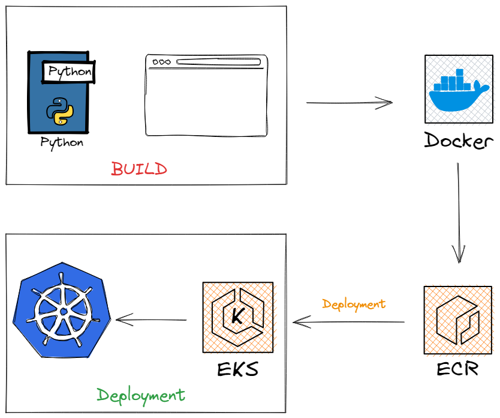

# Cloud-native-monitoring-app

## This is a real-time DevOps project using tools like AWS, Docker, Kubernetes, and Python.

 

### In this Cloud-native DevOps project, we will go through these steps:

1. Create a System Monitoring Application using the Flask framework
2. Run the Python application locally
3. Contanize the application using Docker:
   -  Write Dockerfile
   -  Build a Docker image
   -  Run Docker container
5. Create ECR and push the image to the Repo
6. Create EKS cluster and nodes
7. Create Kubernetes Deployment and Service
8. Post forward and expose the application on Kubernetes
 

