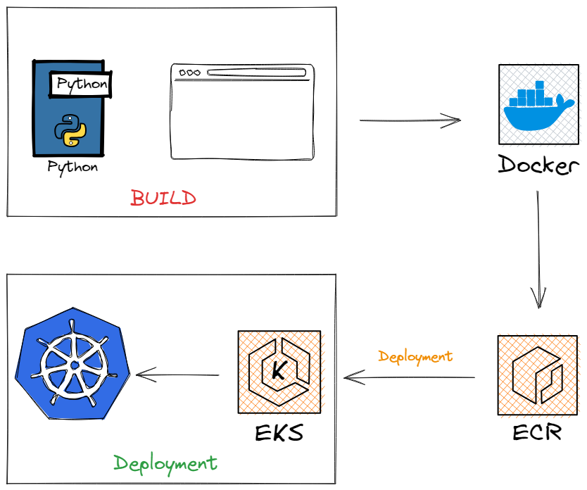
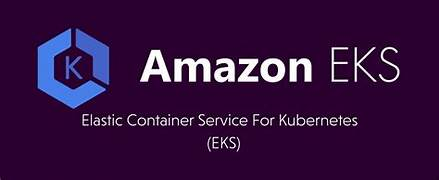
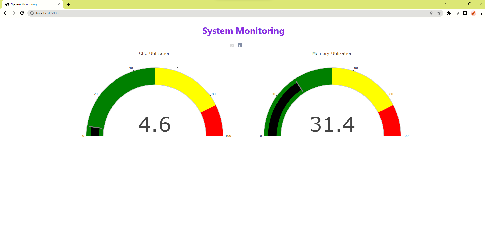

# Cloud native monitoring app on Kubernetes

## This is a real-time DevOps project using tools like AWS, Docker, Kubernetes, and Python.

### In this Cloud-native DevOps project, we will go through these steps:

1. Create a System Monitoring Application using the Flask framework
2. Run the Python application locally
3. Containerize the application using Docker:
   -  Write Dockerfile
   -  Build a Docker image
   -  Run Docker container
5. Create ECR and push the image to the Repo
6. Create EKS cluster and nodes
7. Create Kubernetes Deployment and Service
8. Post forward and expose the application on Kubernetes
   
<br>




## Building & Running Locally

### Pre-reqs

- Be using Linux, WSL, or MacOS, with bash, VScode, etc
- [Python 3.8+](https://www.python.org/downloads/) - for running locally, linting, running tests, etc
- [Docker](https://docs.docker.com/get-docker/) - for running as a container, or image build and push
- [Kubectl](https://kubernetes.io/docs/tasks/tools/) - for deploy applications, inspect and manage cluster resources, and view logs
- [AWS CLI](https://aws.amazon.com/cli/) - for deployment to AWS


The application uses the **psutil** and **Flask**, **Plotly**, **boto3**, **kubernetes** libraries. 
Install them using pip command


### Containers

**Dockerfile**

```Dockerfile
# Use the official Python image as the base image
FROM python:3.9-slim-buster

# Set the working directory in the container
WORKDIR /app

# Copy the requirements file to the working directory
COPY requirements.txt .

# Install the required Python packages
RUN pip3 install --no-cache-dir -r requirements.txt 

# Copy the application code to the working directory
COPY . .

# Set the environment variables for the Flask app
ENV FLASK_RUN_HOST=0.0.0.0

# Expose the port on which the Flask app will run
EXPOSE 5000

# Start the Flask app when the container is run
CMD ["flask", "run"]
```

Run in a container with:

```
docker build . -t my-monitoring-app
docker run -p 5000:5000 my-monitoring-app
```

The app runs under Flask and listens on port 5000 by default, this can be changed with the `PORT` environmental variable.


### Kubernetes

- *Create ECR and push the image to the Repo*


1. Create the ECR client by using Boto3 (Boto3 is the Amazon Web Services (AWS) Software Development Kit (SDK) for Python, which allows Python developers to write software that makes use of AWS services)
```
ecr_client = boto3.client('ecr')
```
2. Create new a new ECR respository:
```
repository_name = "cloud-native-app-repo"
response = ecr_client.create_repository(repositoryName=repository_name)
```
3. Check the respository URI:
```
repository_uri = response['repository']['repositoryUri']
print(repository_uri)
```
   
- *Create EKS cluster and nodes*




- *Create Kubernetes Deployment and Service*
  
```
from kubernetes import client, config

# Load Kubernetes configuration
config.load_kube_config()

# Create a Kubernetes API client
api_client = client.ApiClient()

# Definition the deployment
deployment = client.V1Deployment(
    metadata=client.V1ObjectMeta(name="my-monitoring-app"),
    spec=client.V1DeploymentSpec(
        replicas=1,
        selector=client.V1LabelSelector(
            match_labels={"app": "my-monitoring-app"}
        ),
        template=client.V1PodTemplateSpec(
            metadata=client.V1ObjectMeta(
                labels={"app": "my-monitoring-app"}
            ),
            spec=client.V1PodSpec(
                containers=[
                    client.V1Container(
                        name="my-monitoring-container",
                        image="549065213399.dkr.ecr.eu-north-1.amazonaws.com/cloud-native-app-repo:latest",
                        ports=[client.V1ContainerPort(container_port=5000)]
                    )
                ]
            )
        )
    )
)

# Create the deployment
api_instance = client.AppsV1Api(api_client)
api_instance.create_namespaced_deployment(
    namespace="default",
    body=deployment
)

# Define the service
service = client.V1Service(
    metadata=client.V1ObjectMeta(name="my-monitoring-service"),
    spec=client.V1ServiceSpec(
        selector={"app": "my-monitoring-app"},
        ports=[client.V1ServicePort(port=5000)]
    )
)

# Create the service 
api_instance = client.CoreV1Api(api_client)
api_instance.create_namespaced_service(
    namespace="default",
    body=service
)
```

Check Kubernetes by running these commands (it will check status of deployment, service, pods):
```
kubectl get deployment -n default 
kubectl get service -n default 
kubectl get pods -n default 
```

## Screenshot



Clone the project to any directory where you do development work

```
git clone https://github.com/SangTheInnovator/Cloud-native-monitoring-app
```

